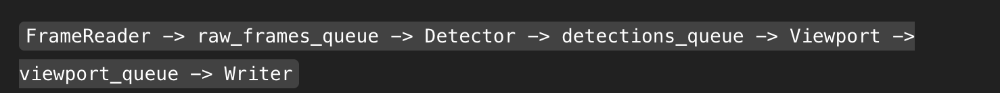

# HomeTeam Viewport Tracking System

> Automatically track the action in sports videos using intelligent motion detection and viewport management.

## What Does This Do?

Ever watched a sports broadcast where the camera smoothly follows the action? This project does something similar, but automatically. It analyzes sports video, detects where the action is happening, and produces a cropped output that keeps the most relevant area in frame.

Think of it as your own personal cameraman that never gets tired and never misses the play.

---

## How It Works

The system processes video through a pipeline of specialized stages, each running independently:



**The Pipeline Stages:**

1. **Frame Reader** - Pulls frames from your video file
2. **Motion Detector** - Figures out where things are moving
3. **Viewport Calculator** - Decides where the "camera" should point
4. **Output Writer** - Produces your final cropped video

Each stage runs in its own process, which means they can work simultaneously without stepping on each other's toes. Frame data flows between them through queues (think of them as conveyor belts passing frames along).

### Why Build It This Way?

When I started this project, I wanted it to feel like something you'd actually deploy in production, not just a proof-of-concept script. Here's the thinking:

- **Each stage has one job** - This makes debugging easier and lets you swap out components without breaking everything
- **They run in parallel** - Video processing is CPU-intensive, so why not use all those cores?
- **If one stage slows down, it doesn't crash everything else** - The queue system provides natural backpressure
- **You can add new stages easily** - Want to add ML-based player detection? Just slot it in

---

## The Queue System (Or: Why Frames Don't Pile Up Forever)

All those queues between stages have size limits. This might seem counterintuitive at first—why not let frames queue up indefinitely?

Because **frames are huge**. A single 1080p frame is several megabytes. If your motion detector gets slow and frames start backing up, you'll run out of memory fast.

Instead, we use bounded queues:

- If a queue fills up, the upstream stage either waits a bit or drops the frame
- This creates backpressure that naturally throttles the pipeline
- It's much better to skip a frame than to crash

**Queue Sizes:**

| Stage Connection | Size | Why This Size? |
|-----------------|------|----------------|
| Reader → Detector | Small-Medium | Prevent pileup if detection gets slow |
| Detector → Viewport | Medium | Detection might produce bursts of activity |
| Viewport → Writer | Small | Output should stay near real-time |

When the pipeline shuts down, each stage sends a `None` through its queue—this is like saying "I'm done, you can stop waiting for more."

---

## Motion Detection: Keeping It Simple

The motion detection uses frame differencing, which is a fancy way of saying "compare frames and see what changed."

Here's the process:
1. Convert frames to grayscale (color doesn't matter for motion)
2. Blur them slightly to ignore tiny noise
3. Subtract one frame from the next
4. Find regions where the difference is significant
5. Draw boxes around those regions

If there are multiple moving objects, the system calculates a weighted center point based on how big each region is. Bigger movements get more weight.

**Why not use fancy ML models?** 

For this use case, simple frame differencing works great and runs way faster. Plus, it doesn't need GPU resources or giant model files. Sometimes the old-school approach is the right one.

---

## The Viewport State Machine

One of the trickiest parts was preventing the viewport from jumping around like a caffeinated squirrel. That's where the state machine comes in.

**Two States:**

- **TRACKING** - "I see motion, let's follow it"
  - Updates the viewport to center on detected movement
  - Stays in this state as long as motion is detected
  
- **STEADY** - "Nothing much happening, hold position"
  - Keeps the viewport where it was
  - Prevents jitter during quiet moments

The system won't flip between states on a single frame. It requires several consecutive frames of the same condition before switching. This is called hysteresis, and it's the same principle that keeps your thermostat from going crazy.

Real broadcast cameras do something similar—they don't instantly whip to every little movement. They track smoothly and deliberately.

---

## Smoothing: Making It Look Natural

Raw viewport positions would be jittery and unwatchable. The smoothing system uses a two-stage approach:

1. **Moving Average** - Takes the last N viewport positions and averages them
2. **Exponential Moving Average (EMA)** - Gives more weight to recent positions

Think of it like this: the moving average catches the big swings, while the EMA adds that final polish that makes movement feel natural.

You can tune this in the config file with the `smoothing_alpha` parameter. Higher values = more responsive but potentially jerkier. Lower values = smoother but might lag behind fast action.

---

## Performance Optimizations

Video processing can eat memory and CPU like nobody's business. Here's what keeps this system from melting your computer:

- **Bounded queues** prevent infinite memory growth
- **Frame dropping** when necessary (better to skip than crash)
- **Lazy initialization** of video writers (don't allocate until needed)
- **No unnecessary copies** of frame data
- **Lightweight detection** instead of heavy ML inference

These aren't just optimizations—they're what makes the difference between a toy project and something you could actually run on a server.

---

## Challenges I Ran Into

### The Queue Backpressure Problem

Early on, if the motion detector got slow, frames would pile up in the queue until the whole system ran out of memory. The solution was adding timeouts and bounded queues, but that required careful thinking about what happens when a queue fills up. Drop frames? Wait? Skip processing?

I settled on a hybrid approach: try to put the frame in the queue with a timeout, and if it's full, just move on. For sports video, missing a frame here and there is fine—viewers won't notice.

### Frame Timing Was Trickier Than Expected

Without knowing the video's frame rate upfront, it's hard to know how fast to process. The solution was to extract the FPS from the source video and treat it as a timeline. Now all stages process frames at a consistent pace.

### Passing Data Between Processes

Python's multiprocessing means each stage runs in a completely separate process with its own memory. You can't just pass pointers around. I ended up creating explicit data classes (`DetectionData`, `ViewportData`) that bundle frames with their metadata. It's more verbose, but way more reliable.

---

## Getting Started

### Prerequisites

- Python 3.8+
- OpenCV
- NumPy

### Local Setup (No Docker)

```bash
# Clone the repository
git clone https://github.com/yourusername/hometeam-viewport.git
cd hometeam-viewport

# Install dependencies
pip install -r requirements.txt

# Run it
python -m hometeamproj.main
```

Your output video will appear in the `output/` directory.

### With Docker

```bash
# Build the image
docker build -t hometeam-viewport .

# Run it (mount output directory)
docker run --rm \
  -v $(pwd)/output:/app/output \
  hometeam-viewport
```

---

## Configuration

Everything is controlled through `config.ini`:

```ini
[video]
input_path = path/to/video.mp4
output_path = output/tracked_video.mp4

[viewport]
width = 1920
height = 1080
smoothing_alpha = 0.2
tracking_threshold = 5

[performance]
frame_queue_size = 10
detection_queue_size = 20
```

**Key Parameters:**

- `smoothing_alpha` - Controls viewport smoothness (0.0-1.0). Lower = smoother, Higher = more responsive
- `tracking_threshold` - Number of consecutive frames needed to change states
- `frame_queue_size` - Max frames between reader and detector
- `detection_queue_size` - Max detection results buffered

Tweak these to match your use case. Lower `smoothing_alpha` for smoother (but slower-reacting) viewports. Adjust queue sizes based on your available memory.

---

## Deploying to AWS (ECS Fargate)

This is designed as a batch job, not a long-running service. The workflow:

1. **Build and push** your Docker image to Amazon ECR
2. **Create an ECS task definition** that runs the container
3. **Trigger tasks** when you need to process videos
4. **Write output** to S3 (or wherever makes sense)

The container does its work and exits—perfect for ECS Fargate's pay-per-task model.

**Why Fargate?**
- No server management
- Pay only when processing
- Automatic scaling for multiple videos
- Memory-safe thanks to bounded queues


## Future Improvements

If I keep working on this, here's what I'd add:

- **Web UI** - Upload videos through a browser, see results without touching the command line
- **REST API** - Trigger processing jobs programmatically
- **ML-based detection** - Use YOLO or similar to detect players specifically, not just motion
- **Multi-camera support** - Process multiple angles and pick the best one
- **GPU acceleration** - Make detection even faster
- **Live stream support** - Handle RTSP streams for real-time viewport tracking


**Built with:** Python, OpenCV, multiprocessing, Docker, and a lot of coffee ☕